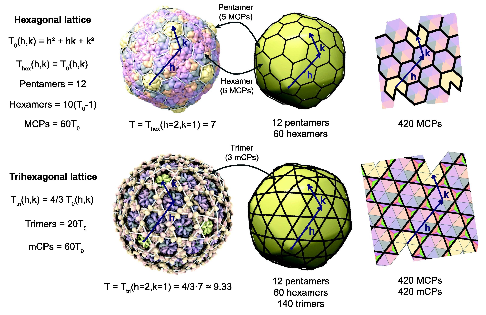

# Introduction

Tailed phages are among the most abundant and diverse organisms in the ecosystem. They regulate bacterial communities and
thus play an essential role in systems from the human gut biome  to the global carbon cycle . The genome lengths
of tailed phages range from 5 to 550 kilobase pairs (kbp), which is key to why they have such diverse roles across
ecosystems . This wide range of genomes lengths necessitates diversity in the size of the protein shells, called capsids, that 
contain these genomes. Indeed, capsids of tailed phages range from 30 to 180 nanometers (nm) in diameter. Despite the diversity in size, tailed phages use only variants of a single type of protein fold,
the HK97 fold . The ubiquity of this fold, and the variety of architectures it displays,
suggests that its versatility helps tailed phages evolve to fill
many different roles. 
The HK97 fold is also not exclusive to tailed phages and is also found in some cellular
nanocompartments called encapsulins.

The majority (80-90%) of tailed phages form icosahedrally symmetric capsids . This highly symmetric architecture is favorable 
for viruses because it reduces the genome space required to encode capsid proteins. Icosahedral symmetry is the most common 
type of symmetry seen in viral capsids. However, tailed phages stand out for how they build capsids with larger genomes and more complex architectures 
than similar families of icosahedral viruses.
Generalized theories of icosahedral capsid geometry describe several possible lattices capsids can adopt.
Each 2D lattice 
represents a different way that the Major Capsid Proteins (MCPs), and sometimes minor Capsid Proteins (mCPs), can form into
locally symmetric groups called capsomers. The triangulation number, or T-number, determines the total number of proteins, 
and thus the total number of capsomers, used to build a capsid. A capsid requires $$60T_0$$ total MCPs to build a 
capsid.

|  |
|:--:| 
| *Figure 1: PLACEHOLDER FOR GEOMETRIC FIGURE* |

These geometric theories have proven useful in analyzing and classifying viral capsids. The T-number effectively 
predicts capsid and genome sizes in tailed phages and other viral families, but the lattice's meaning is harder to 
interpret. Strictly speaking, the polygons represent locally symmetric groups of proteins, but coarse-grained models of 
capsid assembly and dynamics often treat capsomers as rigid mechanical subunits. 
Identifying the rigid subunits of HK97-fold capsids can help explain how they achieve their 
versatility, and whether geometric theories can effectively predict such rigid subunits.
HK97 fold capsids generally use pentamers and (asymmetric) hexamers as their procapsid assembly units, but maturation 
mechanisms can differ significantly between capsids, so they are not necessarily the rigid subunits of
the mature capsid. Inter-capsomer interactions in domains unique to one particular fold often regulate assembly, and 
the maturation process results in significant conformational changes in the proteins.

We aim to identify rigid subunits of mature capsids using HK97-like folds and determine how their unique inter-capsomer 
interactions affect their rigidity. Identifying the rigid subunits of viral capsids often require sophisticated experimental 
or computational techniques that are not suited to systematic application. We implement a 
general-purpose technique developed by  for identifying quasi-rigid subunits called Quasi-Rigid Domain 
Decomposition. This technique has two main features: the determination of capsid dynamics through Normal Mode Analysis 
using a coarse-grained Elastic Network Model, and the subdivision of the capsid into quasi-rigid domains using clustering 
methods. We apply the method to encapsulins and capsids with T numbers from 1 to 13, ranging in diameter 
from 20nm to 90nm. We then determine the overlap between these subunits and the capsomers predicted by geometric theory,
and attempt to determine how the unique inter-capsomer interactions of each capsid impact their rigid subunits.

# References

