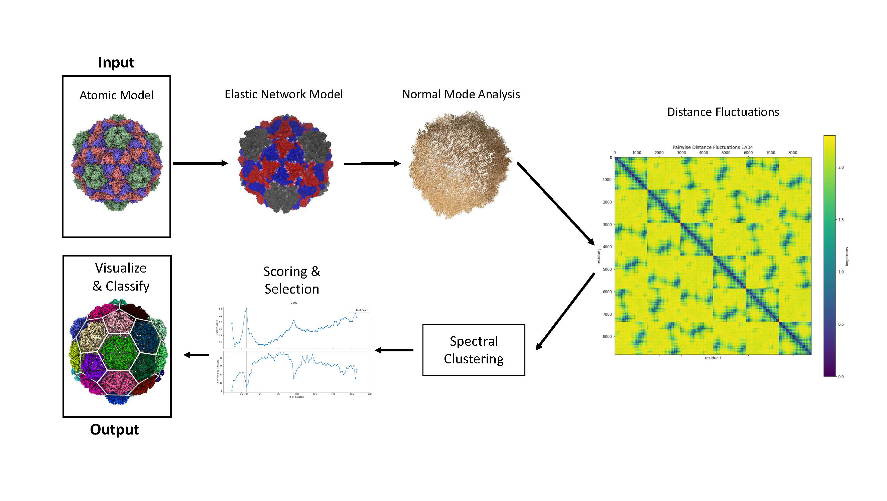
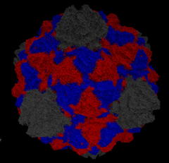
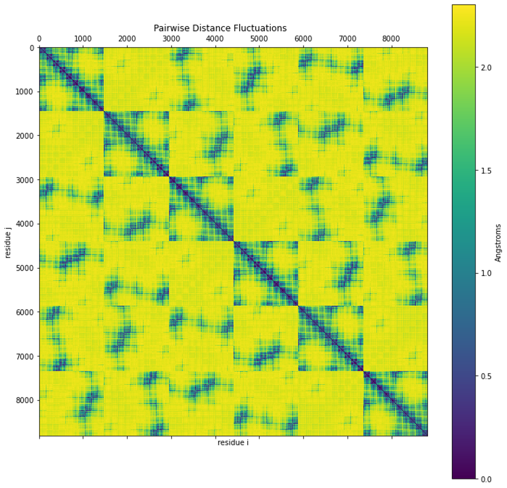
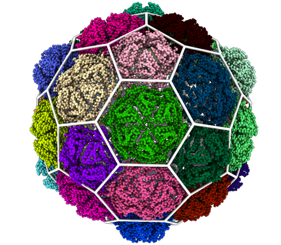

# 2. Methods

## 2.1 Data Acquisition

All atomic models are acquired in PDB format and are, with few exceptions, from the RCSB Protein Databank. The
majority of .pdb files for viral capsids contain an asymmetric unit and a set of icosahedral rotations that build the
full capsid.  These models are built by fitting folded proteins into density distributions measured using X-Ray Crystallography
or Cryo-electron Microscopy.

|  |
|:--:| 
| *Figure 1: Outline of the workflow and techniques used for our methods.* |

## 2.2 Normal Mode Analysis

Normal Mode Analysis (NMA) is a technique for analyzing the near-equilibrium dynamics of a physical system. NMA aims to
approximate vibrations around an equilibrium by determining the normal modes of vibrations accessible by the system.
Typically only a subset of the normal modes are used to simplify computations, most often the low frequency modes.
The assumptions necessary for accurate NMA 
are that the system is in a local equilibrium and that the interaction potential can be approximated as harmonic.
The harmonic approximation only holds near the equilibrium and will lose accuracy as vibrations grow larger. 

The harmonic approximation also means specific local constraints won't be represented unless added explicitly. This means
usually rigid or constrained elements of a molecule would fluctuate freely. This means NMA is best used to determine
large-scale dynamics that are independent of these local interactions. In fact, NMA results are most often interpreted
as properties of the 3D shape of the system, not its specific interactions. 

The requirement that the system be in equilibrium means that some models would require an energy minimization step prior
to performing NMA. This can be a very costly step depending on the form of the underlying potential, and can negatively
impact the accuracy of the NMA if the system is not fully minimized. 
It is useful then, that some simpler models, such as the Elastic Network Models discussed in section 2.3, avoid this step completely since the 
initial conformation can be explicitly set as the equilibrium.

The mathematical formulation of NMA begins by considering a taylor series of the potential energy about the equilibrium.

$$
\begin{equation}
    V(\vec{q}) = V(\vec{q^0}) + \sum_{i}\Delta q_i \frac{\partial V}{\partial q_i }|_{q=q^0}  + 1/2 \sum_{i,j}\Delta q_i \Delta q_j \frac{\partial^2 V}{\partial q_i \partial q_j }|_{q=q^0} + \dots
\end{equation}
$$

Where $$\vec{q}$$ is the state vector of the entire system, i.e. a 1D vector with all degrees of freedom. 
The first and second terms of this expansion are zero in any equilibrium conformation. Truncating the remaining terms
gives us our second order (harmonic) approximation of the potential about the equilibrium.
Arranging all of our second derivatives into a matrix $$\mathbf{H}$$, called the Hessian Matrix, allows us to rewrite the 
potential using matrix-vector products.

$$
\begin{equation}
    H_{ij} = (\frac{\partial^2 V}{\partial q_i \partial q_j})^0
\end{equation}
$$

$$
\begin{equation}
    V(\Delta \vec{q}) = \frac{1}{2} \Delta \vec{q}^T \mathbf{H} \Delta \vec{q}
\end{equation}
$$

Where $$\Delta \vec{q}$$ is the deviation from the equilibrium conformation $$\vec{q}^0$$.
Our equation of motion may then be written using the Hessian as follows:

$$
\begin{equation}
    \mathbf{M} \frac{d^2 \Delta \vec{q}}{dt^2} + \mathbf{H} \Delta \vec{q} = 0
\end{equation}
$$

Where the matrix $$\mathbf{M}$$ is diagonal matrix containing the masses associated with each degree of freedom. This can
be transformed into a generalized eigenvalue problem to determine the normal mode vibrations of the system.

$$
\begin{equation}
    \mathbf{H} \vec{v_k} = \omega^2 \mathbf{M} \vec{v_k}
\end{equation}
$$

These eigenvectors represent the magnitude and direction of normal mode vibrations along each degree of freedom and the 
eigenvalues are the squared frequencies of these modes. Calculating all eigenvectors and eigenvalues of the system would
be prohibitive, it would be preferable to only calculate a significant subset. Thermodynamically, we expect motion along 
higher energy modes to be less likely. The contribution of an individual mode is inversely proportional to its frequency.

$$
\begin{equation}
    V(\vec{v_k}) = \frac{1}{2} \Delta \vec{v_k}^T \mathbf{H} \Delta \vec{v_k} = \frac{\omega_k^2}{2}
\end{equation}
$$

As such when applying NMA one typically calculates only the $$n_k$$ lowest frequency modes and considers only vibration along
those modes.

A useful application of NMA is determining the cross-correlations between motion in each degree of freedom. These correlations
represent the statistical overlap between these motions. A high correlation means the two degrees often fluctuate together.
The covariance matrix $$\mathbf{C}_{ij}$$ that has these cross-correlations as its entries and can be constructed from the 
inverse of the Hessian matrix in the following manner.

$$
\begin{equation}
    C_{ij} = \langle \Delta q_i \Delta q_j \rangle = k_b T * (\mathbf{H}^{-1})_{ij}
\end{equation}
$$

In the specific case of a model using cartesian coordinates, such as the Anisotropic Network model,
the Hessian and its inverse are organized into $$3 \times 3$$ blocks for
each element of the system. The mean square fluctuations of an element can then be calculated by taking the trace of its
diagonal block.

$$
\begin{equation}
    C_{ii} = \langle (\Delta q_i)^2 \rangle = k_b T * tr(\mathbf{H}^{-1}_{ii})
\end{equation}
$$

Where in this case $$\mathbf{H}_{ii}$$ is a $$3 \times 3$$ sublock corresponding to element i. These fluctuations are the
most common way of validating NMA results since they are readily comparable to Debye-Waller factors (B-factors).
B-factors represent the spread of an electron density and in the case of 
X-rax crystallography are measured directly for each atom in a pdb. B-factors can be related to mean square fluctuations by the relation
$$B = 8 \pi^2 \langle \Delta x^2 \rangle$$.    This makes for a convenient way
to validate results and determine the optimal parameters in one's choice of model.

With this mathematical formulation of NMA we can now select a model with a potential to use in Eq. 1.

||
|:--:| 
| *Figure 2: An animation showing vibration along one of the normal modes* |

## 2.3 The Anisotropic Network Model

Elastic Network Models (ENMs) are among the most versatile models for describing large scale protein dynamics. They represent
proteins as a network of masses connected to their neighbors by springs. They require very few parameters to fully describe the system, and are
easily coarse-grained to any level depending on computational needs. We select the Anisotropic Network Model (ANM), for 
its ability to describe normal mode directions in 3D. This property of ANM allows applications where it is used to generate
alternate conformations by deforming a molecule along the normal modes. 

To simplify computations the full atomic model can be transformed into an Elastic Network by coarse graining to the level
of protein residues. We select the alpha-carbon atoms as representative centroids for each protein residue.
Rather than connect all residues, only residues within a cutoff distance
of each other are connected with springs. This is expressed through the connectivity matrix $$\mathbf{\Gamma}$$.  

$$
\begin{equation}
    \Gamma_{ij} = \biggr \{
    \begin{array}{ll}
      \gamma, & R_{ij} \leq r_c \\
      0, & R_{ij} > r_c
    \end{array}
\end{equation}
$$

Where $$\gamma$$ is the spring constant, $$r_c$$ is the cutoff distance, and $$R_{ij}$$ is the distance between residues
i and j. The choice of spring constant typically has little impact on vibrational modes which result from the shape and
connectivity of the network.

Optimal spring constants are found in the range of $$1.0 \pm 0.5 \frac{kcal}{mol * Å^2}$$
and the cutoff distance is typically $$15Å$$. Since the spring constant doesn't significantly affect
results it is typically set to exactly 1.0 to simplify calculations. 

Using a cuttof of $$15Å$$ in Eq. (9) means the majority of the entries in the connectivity matrix are 0
as most capsids are significantly larger than the cutoff distance. This allows a significant simplification
of computations through the use of sparse matrices.

The potential of ANM can be written using the connectivity matrix and is the sum of spring potentials between each pair
of connected residues.

$$
\begin{equation}
    V(\vec{x}) =  \frac{1}{2 \sum_{i|i \neq j} \Gamma_{ij} (||\vec{x}_i - \vec{x}_j|| - ||\vec{x}^0_i - \vec{x}^0_j||) }
\end{equation}
$$

Where $$\vec{x}_i$$ is the coordinate vector of residue i and $$\vec{x}_i^0$$ is the equilibrium coordinate vector for that residue.
This potential can be used to construct our Hessian and perform NMA on our network.

|  |
|:--:| 
| *Figure 3: A representation of an Elastic Network Model using the example of a Pyrococcus Furiosus VLP. (pbd: 2e0z)* |

The ANM Hessian can be derived by placing our potential from Eq. (10) into Eq. (2). Because ANM uses three dimensional coordinates the
Hessian of an ANM with $$N$$ residues is a $$3N \times 3N$$ block matrix that consists of a $$3 \times 3$$ block for
each residue, for a total of $$N \times N$$ blocks. The off-diagonal blocks have the following form.

$$
\begin{equation}
    \mathbf{H}_{ij} = \frac{\textbf{$\Gamma$}_{ij}}{R_{ij}^2} \vec{r}_{ij} \otimes \vec{r}_{ij}
\end{equation}
$$

Where $$\vec{r}_{ij}$$ is the distance vector between residues, $$R_{ij}^2$$ is the distance between residues, and
$$\otimes$$ denotes the outer product of two vectors yielding a $$3 \times 3$$ matrix.
The diagonal blocks of our Hessian Matrix are then the sum of all other blocks in that row.

$$
\begin{equation}
    \mathbf{H}_{ii} = - \sum_{i|i \neq j} \mathbf{H}_{ij}
\end{equation}
$$

In the case where all masses and spring constant are uniform they reduce to a scalar multiplication which can let us rewrite
Equation (5) extracting the spring constant and mass from the matrices.

$$
\begin{equation}
    \gamma \mathbf{H} \vec{v_k} = m \omega^2 \vec{v_k}
\end{equation}
$$

As a result they can be ignored in the eigenvalue problem as they merely scale the resulting frequencies 
$$\omega^2_* = \frac{\gamma}{m} \omega^2$$.
A physical value for the frequencies can be extracted from a choice of mass that reflects our level of coarse-graining.

When validating the results of NMA using ANM, the formula to compare with B-factors takes the following form.

$$
\begin{equation}
    B_i = \frac{8 \pi^2 k_b T }{3 \gamma} tr(\mathbf{H}^{-1}_{ii})
\end{equation}
$$

The pairwise correlations in Equation (6) can be used to approximate fluctuations in distance between. 

$$
\begin{equation}
    f_{ij}^2 = Var(R^{2}_{ij})  = \mathbf{C}_{ii} + \mathbf{C}_{jj} - 2 \mathbf{C}_{ij}
\end{equation}
$$

The Hessian matrix is, however, singular and cannot be exactly inverted, having exactly 6 zero eigenvalues. We can instead
construct a pseudo-inverse from the eigenvectors/normal modes.

$$
\begin{equation}
    \mathbf{H}^{-1} = \sum_{k=1}^{3N - 6} \frac{1}{\omega_k^2} \vec{v_k} \otimes \vec{v_k}
\end{equation}
$$

|  |
|:--:| 
| *Figure 4: A matrix of pairwise distance fluctuations* |

## 2.4 Quasi-Rigid Subdivisions

If capsomers represent mechanical or assembly units of the capsid, we would expect them to be relatively rigid. Rigidity
is thus the measure we will use to separate the residues into rigid subunits.
Rigid structures have zero fluctuations in distance
between any elements of the structure, but realistically there are some internal fluctuations. Thus the method aims to
minimize distance fluctuations, as defined in Eq. (15), a metric called quasi-rigidity. This metric was previously used to identify
rigid domains in protein structures, including viral capsids. These methods were, however, primarily targeted towards
smaller protein structures. 

Once we have used NMA to get the pairwise distance fluctuations between all residues of a capsid we need to select an algorithm or 
heuristic that can subdivide our network into optimally quasi-rigid subunits. There exist many algorithms to identify
optimal clusterings of data, but when dealing with large, sparse datasets, Spectral Clustering is a robust and computationally
efficient algorithm. 

### Spectral Clustering

Spectral clustering has its roots in graph theory, and can be formulated as an approximation
to the Normalized Graph Cut problem. An advantage that this provides over distance based clustering methods is that clusters
can be arbitrary shapes. Spectral clustering is also based on similarity rather than distance, which can be useful simplify calculations.
Since the similarity of distant elements approach 0, approximating them as exactly 0 allows one to use a sparse similarity
matrix. To make use of the technique however, we must first transform our distance fluctuations into a graph. Specifically
the Laplacian Matrix of a graph, which represents the action of the Discrete Laplace Operator on the graph/

First we transform our measure of dissimilarity, distance fluctuations, into a measure of similarity using a Gaussian 
Weighting Function. This transformation is chosen because it emphasizes local neighborhoods
of rigidity, in a similar manner to a nearest neighbor graph, and because large fluctuations approach 0 very quickly. 
Residues that are not connected by springs are assumed to 
have zero similarity in order to preserve the sparsity of the matrix and reduce memory requirements.

$$
\begin{equation}
    S_{i,j} = \Gamma_{ij} e^{-f_{i,j}^2 / 2 \bar{f}^2}
\end{equation}
$$

Where $$\bar{f}^2$$ is the average squared distance fluctuation between connected residues. This similarity matrix can
now be thought of as the adjacency matrix of a weighted graph. Spectral graph techniques require the Laplacian matrix of
a graph. The Laplacian matrix represents the action of a discrete laplace operator on a graph.
One can transform a similarity matrix into a Laplacian matrix, specifically the Symmetric Normalized Laplacian, with the 
following identity.

$$
\begin{equation}
    \mathbf{L} = \mathbf{I} - \mathbf{D}^{-1/2} \mathbf{S} \mathbf{D}^{-1/2}
\end{equation}
$$

Where $$D$$ is a diagonal matrix whose entries are the number of neighbors of each node and $$I$$ is the identity matrix.

### Laplacian Embedding

Finding an optimal subdivision of our graph into $$n_c$$ clusters requires the lowest $$n_c$$ eigenvalues and eigenvectors
of the Laplacian matrix. These eigenvectors are useful because they each represent an approximate partitioning of the
graph into two components.  In the ideal case of well separated clusters, each of these eigenvectors
would represent membership in a single cluster. In practice this is rarely ever the case, but the eigenvectors can be
used to build a $$n_c$$ dimensional space where we can use a more generic clustering algorithm such as k-means to determine
cluster membership.

### Clustering Embedded Points

If $$\Lambda$$ is a matrix with the eigenvectors of the laplacian matrix as its columns, its rows now represent points
in an $$n_c$$ dimensional space.
Normalizing these points and then clustering them will then yield our final set of clusters.

It should not be necessary to use a sophisticated clustering scheme at this step as the spectral embedding should have done
most of the work. K-means is chosen to perform the final clustering for its simplicity.

## 2.5 Scoring & Selection

Since our methods take the number of clusters as input, we need to compare results across different numbers of clusters
and select the optimal clustering. This requires the use of a scoring metric. We select a scoring metric that measures
the compactness and separation of our clusters. This score is calculated in the eigenvector space for convenience, but
the score could be applied directly to the distance fluctuations.

$$
\begin{equation}
    \rho(Q) = \frac{1}{N} \sum_{i=1}^N \frac{\delta_{i,c_0}}{\delta_{i,c_1}}
\end{equation}
$$

Where $$N$$ is the number of residues, $$\delta_{i,c_0}$$ is the distance between a residue and the cluster centroid it
belongs to (compactness), and $$\delta_{i,c_1}$$ is the distance from a residue to the next nearest cluster (separation).

|  |
|:--:| 
| *Figure 5: Comparative plots for Pyrococcus Furiosus VLP. The first graph is the quality score from Eq. (19). The second plot is of the number of clusters that contain a unique number of residues. This is an indicator of whether clusters are uniform.* |

## 2.6 Classification & Visualization

The labels assigned to each residue allow us to visualize the results of the clustering in ChimeraX. We color each residue
based on its cluster label and then overlay a 3d structure with a lattice that fits the clustering most accurately.

|  |
|:--:| 
| *Figure 6: The results of visualizing Pyrococcus Furiosus VLP* |

# References

