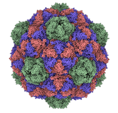

# 2. Methods

## 2.1 Data Acquisition

All atomic models are acquired in PDB format and are, with few exceptions, from the RCSB Protein Databank. The
majority of .pdb files for viral capsids contain an asymmetric unit and a set of icosahedral rotations that build the
full capsid. 

|  |
|:--:| 
| *Figure 1: The PDB file 2e0z visualized in ChimeraX* |

## 2.2 The Anisotropic Network Model

Elastic Network Models (ENMs) are among the most popular models for describing large scale protein dynamics. They represent
proteins as a network of masses and springs, and thus require very few parameters to fully describe the system. They are
also able to be coarse grained to any level depending on computational needs. We select the Anisotropic Network Model(ANM),
the most commonly used ENM for its ability to describe protein conformational changes in three dimensions. 
We construct our model by coarse-graining to the level of protein residues, selecting the carbon alpha atoms as the representative
coordinates of each residue, and connect them to other residues within a cutoff distance.

|  |
|:--:| 
| *Figure 2: A representation of an Elastic Network Model using the example pdb 2e0z.* |

The overall potential of the system is thus the sum of harmonic potentials between each residue. The summation is performed
only over connected residues determined by a spring connectivity matrix.

$$
\begin{equation}
    V(\vec{x}) =  \frac{1}{2 \sum_{i|i \neq j} \Gamma_{ij} (||\vec{x}_i - \vec{x}_j|| - ||\vec{x}^0_i - \vec{x}^0_j||) }
\end{equation}
$$

Here $$\Gamma$$ is our spring connectivity matrix as determined using our cutoff distance and choice of spring constant.  

$$
\begin{equation}
    \Gamma_{ij} = \biggr \{
    \begin{array}{ll}
      \gamma, & R_{ij} \leq r_c \\
      0, & R_{ij} > r_c
    \end{array} 
\end{equation}
$$

To simplify the model we set the spring constant to 1 for all residues. Our cutoff distance is set to $$10Å$$.

## 2.3 Normal Mode Analysis

We are interested in the large scale dynamics of the capsid near equilibrium. This prompts us to make use of a technique
called Normal Mode Analysis.

||
|:--:| 
| *Figure 3: An animation showing vibration along one of the normal modes* |

Normal Mode Analysis is a technique for describing the near equilibrium dynamics of a physical system. It aims to
approximate vibrations around the equilibrium by assuming harmonic potentials and considering only
a subset of the normal modes of the system. The assumptions necessary to allow this technique are that the system has a 
specific equilibrium configuration and that all particles in the system interact under a simple harmonic potential. This
assumption is taken to be accurate only locally. The further the system strays from the equilibrium the less accurate this
technique will be. 

The method disregards any specific interactions and constraints in the system. As a result it describes only macroscopic
motions of the system and will fail to represent complex bonds within a protein. This means it is best paired with a model
that also doesn't concern itself with microscopic forces and constraints. It also suggests that the technique is best 
applied to systems large enough that collective motions are dominant.

The mathematical formulation of NMA begins by examining a taylor series of the potential about the equilibrium.

$$
\begin{equation}
    V(\vec{x}) = V(\vec{x^0}) + \sum_{i}\Delta x_i \frac{\partial V}{\partial x_i }\biggr|_{x=x^0}  + \sum_{i,j}\Delta x_i \Delta x_j \frac{\partial^2 V}{\partial x_i \partial x_j }\biggr|_{x=x^0} + \dots
\end{equation}
$$

The first and second terms of this expansion are zero in any equilibrium conformation. Truncating the remaining terms
gives us our second order expansion of our potential about the equilibrium.

The matrix of second derivatives of our potential around the equilibrium is called the Hessian Matrix.

$$
\begin{equation}
    H_{ij} = (\frac{\partial^2 V}{\partial x_i \partial x_j})^0
\end{equation}
$$

Our equation of motion may be written using the Hessian as follows:

$$
\begin{equation}
    \boldsymbol{M} \frac{d^2 \Delta \vec{x}}{dt^2} + \boldsymbol{H} \Delta \vec{x} = 0
\end{equation}
$$

Where the matrix M is a mass matrix, which in our case is the identity matrix and can be ignored. The normal modes of
the system are thus solutions to the following eigenvalue problem.

$$
\begin{equation}
    \boldsymbol{H} \vec{v_k} = \omega^2 \vec{v_k}
\end{equation}
$$

The Hessian of our ANM takes the following form.

$$
\begin{equation}
    \mathbf{H}_{ij} = \frac{\textbf{$\Gamma$}_{ij}}{R_{ij}^2} \vec{r}_{ij} \otimes \vec{r}_{ij}
\end{equation}
$$

The diagonal blocks of our Hessian Matrix are also 3x3 matrices.

$$
\begin{equation}
    \mathbf{H}_{ii} = - \sum_{i|i \neq j} \mathbf{H}_{ij}
\end{equation}
$$

From the results of NMA we can determine the pairwise fluctuations in distance between residues by first constructing the
cross correlation between the fluctuation of residues. The correlation matrix is related to the inverse of the Hessian by taking
the trace of each 3x3 submatrix.

$$
\begin{equation}
    \mathbf{C}_{ij} = \langle \Delta \mathbf{R}_i \Delta \mathbf{R}_j \rangle = tr(\mathbf{H}^{-1}_{ij})
\end{equation}
$$

The Hessian matrix is, however, singular and cannot be exactly inverted, having 6 zero eigenvalues. We instead construct
a pseudo-inverse from the eigenvectors/normal modes we calculated.

$$
\begin{equation}
    \mathbf{H}^{-1} = \sum_{k=1}^{3N - 6} \frac{1}{\omega_k^2} \vec{v_k} \otimes \vec{v_k}
\end{equation}
$$

|  |
|:--:| 
| *Figure 4: A matrix of pairwise distance fluctuations* |

## 2.4 Spectral Clustering

$$
\begin{equation}
    f^{2}_{ij} = Var(d^{2}_{ij}) = \langle d^{2}_{ij} \rangle - \langle d_{ij} \rangle ^{2}
\end{equation}
$$

*Assumption: Capsomers correspond to quasi rigid domains of a viral capsid*

Here we use the same definition of a quasi rigid domain as described in . A rigid structures is a structure in
which the distances between elements of the structure are fixed over time and under transformations in space. A quasi-rigid structure
is thus a structure where the fluctuations between elements of the structure are minimized. We calculate the pairwise
distance fluctuation of a structure in the following manner.

A quasi rigid domain of a protein structure is a domain of the protein which satisfied our definition of a quasi rigid 
structure.

Now that we have determined the pairwise distance fluctuations between the residues of the capsid we need to determine
an optimal subdivision, or clustering, of the system. There exist many algorithms to identify optimal clusterings of
data. One of the most effective algorithms used when dealing with large, sparsely connected systems is Spectral Clustering.
This method requires us to first transform our measure of dissimilarity, distance fluctuations, into a measure of similarity.

$$
\begin{equation}
    S_{i,j} = e^{-D_{i,j}^2 / 2 \bar{D}^2}
\end{equation}
$$

We can use the nature of connectivity in our model to simplify our similarity matrix by setting the similarity of unconnected
residues to zero. 

Spectral embedding is a technique based on graph theory, and thus requires as an input a Laplacian Matrix. We can transform
our similarity matrix into a Laplacian matrix, specifically the Symmetric Normalized Laplacian, with the following
identity.

$$
\begin{equation}
    \mathbf{L} = \mathbf{I} - \mathbf{D}^{-1/2} \mathbf{S} \mathbf{D}^{-1/2}
\end{equation}
$$

### Spectral Embedding

The eigenvectors of this graph now represent a new set of points in a higher dimensional space that can be clustered
using a simpler method such as the k-means algorithm.

### Clustering Embedded Points

## 2.5 Scoring & Selection

## 2.6 Classification & Visualization

# References

