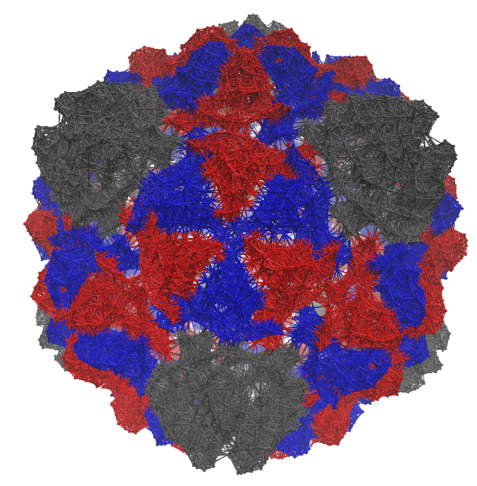

# 2. Methods

## 2.1 Data Acquisition

All atomic models are acquired in PDB format and are, with few exceptions, from the RCSB Protein Databank. The
majority of .pdb files for viral capsids contain an asymmetric unit and a set of icosahedral rotations that build the
full capsid.  These models are built by fitting folded proteins into density distributions measured using X-Ray Crystallography
or Cryo-electron Microscopy.

|  |
|:--:| 
| *Figure 1: Pyrococcus Furiosus VLP visualized in ChimeraX using pdb id 2e0z.* |

## 2.2 Normal Mode Analysis

Normal Mode Analysis (NMA) is a technique for analyzing the near-equilibrium dynamics of a physical system. NMA aims to
approximate vibrations around an equilibrium by determining the normal modes of vibrations accessible by the system.
Typically only a subset of the normal modes are used to simplify computations, most often the low frequency modes.
The assumptions necessary for accurate NMA 
are that the system is in a local equilibrium and that the interaction potential can be approximated as harmonic.
The harmonic approximation only holds near the equilibrium and will lose accuracy as vibrations grow larger. 

The harmonic approximation also means specific local constraints won't be represented unless added explicitly. This means
usually rigid or constrained elements of a molecule would fluctuate freely. This means NMA is best used to determine
large-scale dynamics that are independent of these local interactions. In fact, NMA results are most often interpreted
as properties of the 3D shape of the system, not its specific interactions. 

The requirement that the system be in equilibrium means that some models would require an energy minimization step prior
to performing NMA. This can be a very costly step depending on the form of the underlying potential, and can negatively
impact the accuracy of the NMA if the system is not fully minimized. 
It is useful then, that some simpler models, such as the Elastic Network Models discussed in section 2.3, avoid this step completely since the 
initial conformation can be explicitly set as the equilibrium.

The mathematical formulation of NMA begins by considering a taylor series of the potential energy about the equilibrium.

$$
\begin{equation}
    V(\vec{q}) = V(\vec{q^0}) + \sum_{i}\Delta q_i \frac{\partial V}{\partial q_i }|_{q=q^0}  + 1/2 \sum_{i,j}\Delta q_i \Delta q_j \frac{\partial^2 V}{\partial q_i \partial q_j }|_{q=q^0} + \dots
\end{equation}
$$

Where $$\vec{q}$$ is the state vector of the entire system, i.e. a 1D vector with all degrees of freedom. 
The first and second terms of this expansion are zero in any equilibrium conformation. Truncating the remaining terms
gives us our second order (harmonic) approximation of the potential about the equilibrium.
Arranging all of our second derivatives into a matrix $$\mathbf{H}$$, called the Hessian Matrix, allows us to rewrite the 
potential using matrix-vector products.

$$
\begin{equation}
    H_{ij} = (\frac{\partial^2 V}{\partial q_i \partial q_j})^0
\end{equation}
$$

$$
\begin{equation}
    V(\Delta \vec{q}) = \frac{1}{2} \Delta \vec{q}^T \mathbf{H} \Delta \vec{q}
\end{equation}
$$

Where $$\Delta \vec{q}$$ is the deviation from the equilibrium conformation $$\vec{q}^0$$.
Our equation of motion may then be written using the Hessian as follows:

$$
\begin{equation}
    \mathbf{M} \frac{d^2 \Delta \vec{q}}{dt^2} + \mathbf{H} \Delta \vec{q} = 0
\end{equation}
$$

Where the matrix $$\mathbf{M}$$ is diagonal matrix containing the masses associated with each degree of freedom. This can
be transformed into a generalized eigenvalue problem to determine the normal mode vibrations of the system.

$$
\begin{equation}
    \mathbf{H} \vec{v_k} = \omega^2 \mathbf{M} \vec{v_k}
\end{equation}
$$

These eigenvectors represent the magnitude and direction of normal mode vibrations along each degree of freedom and the 
eigenvalues are the squared frequencies of these modes. Calculating all eigenvectors and eigenvalues of the system would
be prohibitive, it would be preferable to only calculate a significant subset. Thermodynamically, we expect motion along 
higher energy modes to be less likely. The contribution of an individual mode is inversely proportional to its frequency.

$$
\begin{equation}
    V(\vec{v_k}) = \frac{1}{2} \Delta \vec{v_k}^T \mathbf{H} \Delta \vec{v_k} = \frac{\omega_k^2}{2}
\end{equation}
$$

As such when applying NMA one typically calculates only the $$n_k$$ lowest frequency modes and considers only vibration along
those modes.

A useful application of NMA is determining the cross-correlations between motion in each degree of freedom. These correlations
represent the statistical overlap between these motions. A high correlation means the two degrees often fluctuate together.
The covariance matrix $$\mathbf{C}_{ij}$$ that has these cross-correlations as its entries and can be constructed from the 
inverse of the Hessian matrix in the following manner.

$$
\begin{equation}
    C_{ij} = \langle \Delta q_i \Delta q_j \rangle = k_b T * (\mathbf{H}^{-1})_{ij}
\end{equation}
$$

In the specific case of cartesian coordinates, the Hessian and its inverse are organized into $$3 \times 3$$ blocks for
each element of the system. The mean square fluctuations of an element can then be calculated by taking the trace of its
diagonal block.

$$
\begin{equation}
    C_{ii} = \langle (\Delta q_i)^2 \rangle = k_b T * tr(\mathbf{H}^{-1}_{ii})
\end{equation}
$$

Where in this case $$\mathbf{H}_{ii}$$ is a $$3 \times 3$$ sublock corresponding to element i. These fluctuations are the
most common way of validating NMA results since they are readily comparable to Debye-Waller factors (B-factors).
B-factors represent the spread of an electron density and in the case of 
X-rax crystallography are measured directly for each atom. B-factors can be related to mean square fluctuations by the relation
$$B = 8 \pi^2 \langle \Delta x^2 \rangle$$.    This makes for a convenient way
to validate results and determine the optimal parameters for the underlying model.

With this mathematical formulation of NMA we can now select a model with a potential to use in Eq. 1.

||
|:--:| 
| *Figure 3: An animation showing vibration along one of the normal modes* |

## 2.3 The Anisotropic Network Model

Elastic Network Models (ENMs) are among the most versatile models for describing large scale protein dynamics. {} They represent
proteins as a network of masses connected to their neighbors by springs. They require very few parameters to fully describe the system, and are
easily coarse-grained to any level depending on computational needs. We select the Anisotropic Network Model (ANM),
the most commonly used ENM and the simplest in its formulation.

These models are used alongside Normal Mode Analysis and the results are validated by comparing their prediction of mean squared fluctuations
to Debye-Waller factors (B-factors).

We construct our model by coarse-graining to the level of protein residues, selecting only the carbon alpha atoms as the representative
coordinates of each residue. 

Rather than connect all residues, only residues within a cutoff distance
of each other are connected with springs. We use the connectivity matrix $$\mathbf{\Gamma}$$ to represent which residues are
connected.

$$
\begin{equation}
    \Gamma_{ij} = \biggr \{
    \begin{array}{ll}
      \gamma, & R_{ij} \leq r_c \\
      0, & R_{ij} > r_c
    \end{array}
\end{equation}
$$

Where $$\gamma$$ is the spring constant, $$r_c$$ is the cutoff distance, and $$R_{ij}$$ is the distance between residues
i and j. The choice of spring constant typically has little impact on vibrational modes which primarily stem from the shape and
connectivity of the network. Both constants
are determined by matching residue square fluctuations to B-factors.  
Optimal spring constants are typically near $$1.0 \frac{kcal}{mol * Å^2}$$ 
and the cutoff distance is typically $$18Å$$.  Since the spring constant doesn't significantly affect
results it is typically set to 1 to simplify calculations. 

Using a cuttof of $$18Å$$ in Eq. (1) means the majority of the entries in the connectivity matrix are 0
since most capsids are significantly larger than the cutoff distance. THis allows a significant simplification
of computations through the use of sparse matrices.

The potential of ANM is thus the sum of potentials between each connected residue.

$$
\begin{equation}
    V(\vec{x}) =  \frac{1}{2 \sum_{i|i \neq j} \Gamma_{ij} (||\vec{x}_i - \vec{x}_j|| - ||\vec{x}^0_i - \vec{x}^0_j||) }
\end{equation}
$$

Where $$\vec{x}_i$$ is the coordinate vector of residue i and $$\vec{x}_i^0$$ is the equilibrium coordinate vector for that residue.
This underlying potential serves as the basis for analyzing the system, typically through Normal Mode Analysis (NMA).

|  |
|:--:| 
| *Figure 2: A representation of an Elastic Network Model using the example of a Pyrococcus Furiosus VLP. (pbd: 2e0z)* |

The ANM Hessian can be derived by placing our potential from Eq. (2) into Eq. (4). Because ANM uses three dimensional coordinates the
Hessian of an ANM with $$N$$ residues is a $$3N \times 3N$$ block matrix that consists of $$N \times N$$ blocks. The 
off-diagonal blocks have the following form.

$$
\begin{equation}
    \mathbf{H}_{ij} = \frac{\textbf{$\Gamma$}_{ij}}{R_{ij}^2} \vec{r}_{ij} \otimes \vec{r}_{ij}
\end{equation}
$$

Where $$\vec{r}_{ij}$$ is the distance vector between residues, $$R_{ij}^2$$ is the distance between residues, and
$$\otimes$$ denotes the outer product of two vectors yielding a $$3 \times 3$$ matrix.
The diagonal blocks of our Hessian Matrix are then the sum of all other blocks in that row.

$$
\begin{equation}
    \mathbf{H}_{ii} = - \sum_{i|i \neq j} \mathbf{H}_{ij}
\end{equation}
$$

In the case where all masses are uniform they reduce to a scalar multiplication. 
As a result they can be ignored in the eigenvalue problem as they merely scale the resulting frequencies $$\omega^2_* = \frac{\gamma}{m} \omega^2$$.  
A physical value for the frequencies can be extracted from a choice of mass that reflects our level of coarse-graining.

An important result of NMA is the correlation between the fluctuations of the residues. These correlations represent
the overlap in the motion of two residues.
The covariance matrix $$\mathbf{C}_{ij}$$ has these cross-correlations as its entries and can be constructed from the 
inverse of the Hessian matrix in the following manner.

$$
\begin{equation}
    C_{ij} = \langle \Delta x_i \Delta x_j \rangle = k_b T * tr(\mathbf{H}^{-1}_{ij})
\end{equation}
$$

Where $$\Delta x_i$$ is the distance from equilibrium for residue i. This formula also yields the primary experimental
method to validate ANM. The square fluctuation of residues can be compared directly to experimental Debye-Waller factors
(b-factors) that are typically recorded in PDB files.  

$$
\begin{equation}
    B_i = \frac{8 \pi^2 k_b T }{3 \gamma} \langle (\Delta x_i)^2 \rangle = \frac{8 \pi^2 k_b T }{3 \gamma} C_{ii}
\end{equation}
$$

These correlations can also be used to determine the fluctuations in distance between residues using the following identity.

$$
\begin{equation}
    f_{ij}^2 = Var(R^{2}_{ij})  = \mathbf{C}_{ii} + \mathbf{C}_{jj} - 2 \mathbf{C}_{ij}
\end{equation}
$$

The Hessian matrix is, however, singular and cannot be exactly inverted, having exactly 6 zero eigenvalues. We can instead
construct a pseudo-inverse from the eigenvectors/normal modes.

$$
\begin{equation}
    \mathbf{H}^{-1} = \sum_{k=1}^{3N - 6} \frac{1}{\omega_k^2} \vec{v_k} \otimes \vec{v_k}
\end{equation}
$$

|  |
|:--:| 
| *Figure 4: A matrix of pairwise distance fluctuations* |

## 2.4 Spectral Clustering

To identify our capsomers we need to select what properties we expect of them. If the capsomers represent mechanical or
assembly units of the capsid, we would expect them to be relatively rigid. Rigid structures have zero fluctuations in distance
between any elements of the structure, but we do realistically expect some internal fluctuations. We instead look for 
subunits with minimal internal distance fluctuations, a metric called quasi-rigidity. This metric has been successfully used for
identifying subunits of small capsids in previous works. 

Once we have the pairwise distance fluctuations between the residues of the capsid we need to select an algorithm or 
heuristic that can subdivide our network into optimally quasi-rigid subunits. There exist many algorithms to identify
optimal clusterings of data, but of the most effective algorithms used when dealing with large, sparsely connected systems
is Spectral Clustering. 

This method requires us to first transform our measure of dissimilarity, distance fluctuations, into a measure of similarity.
We do this using the Radial Basis Function (rbf) kernel. This transformation is chosen to mimic a graph with interactions
ocurring primarily in the 'local neighborhood' of each residue.  

$$
\begin{equation}
    S_{i,j} = e^{-f_{i,j}^2 / 2 \bar{f}^2}
\end{equation}
$$

Where $$\bar{f}^2$$ is the average squared distance fluctuation between connected residues.

We can use the nature of connectivity in our model to simplify our similarity matrix by setting the similarity of unconnected
residues to zero. 

### Spectral Graph Embedding

Spectral embedding is a technique based on graph theory, and requires as an input a Laplacian Matrix representing a graph.
We can transform a similarity matrix into a Laplacian matrix, specifically the Symmetric Normalized Laplacian, with the 
following identity.

$$
\begin{equation}
    \mathbf{L} = \mathbf{I} - \mathbf{D}^{-1/2} \mathbf{S} \mathbf{D}^{-1/2}
\end{equation}
$$

### Clustering Embedded Points

The eigenvectors of this graph now represent a set of points in a higher dimensional space that can be clustered
using one of many methods. When aiming to identify $$n$$ clusters we use only the first 

## 2.5 Scoring & Selection

Since our methods take the number of clusters as input, we need to compare results across different numbers of clusters
and select the optimal clustering. This requires the use of a scoring metric. We select a scoring metric that measures
the compactness and separation of our clusters. This score is calculated in the eigenvector space for convenience, but
a score could be devised that uses the distance fluctuations directly.

$$
\begin{equation}
    \rho(Q) = \frac{1}{N} \sum_{i=1}^N \frac{\delta_{i,c_0}}{\delta_{i,c_1}}
\end{equation}
$$

Where $$N$$ is the number of residues, $$\delta_{i,c_0}$$ is the distance between a residue and the cluster centroid it
belongs to (compactness), and $$\delta_{i,c_1}$$ is the distance from a residue to the next nearest cluster (separation).

|  |
|:--:| 
| *Figure 5: Comparative plots for Pyrococcus Furiosus VLP* |

## 2.6 Classification & Visualization

The labels assigned to each residue allow us to visualize the results of the clustering in ChimeraX. We color each residue
based on its cluster label and then overlay a 3d structure with a lattice that fits the clustering most accurately.

|  |
|:--:| 
| *Figure 6: The results of visualizing Pyrococcus Furiosus VLP* |

# References

