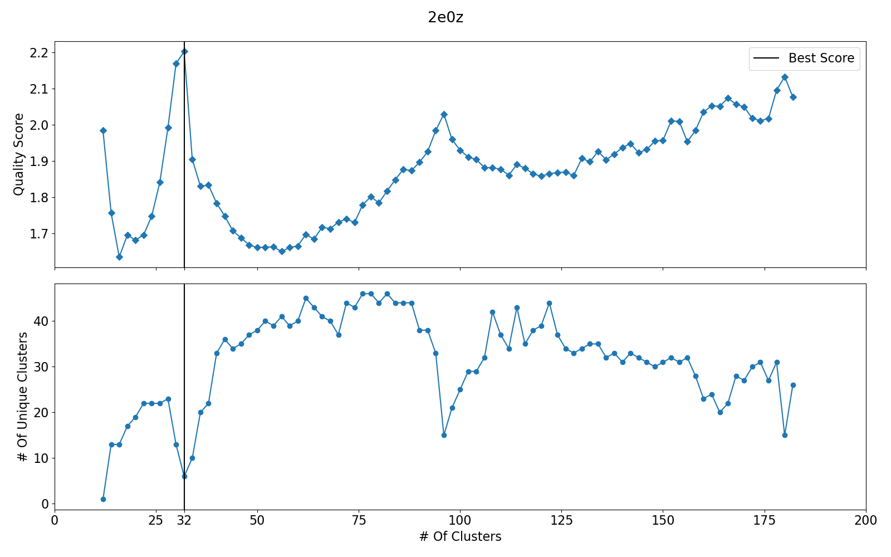

# 2. Methods

## 2.1 Data Acquisition

All atomic models are acquired in PDB format and are, with few exceptions, from the RCSB Protein Databank. The
majority of .pdb files for viral capsids contain an asymmetric unit and a set of icosahedral rotations that build the
full capsid.  These models are built by fitting folded proteins into density distributions measured using X-Ray Crystallography
or Cryo-electron Microscopy. 

|  |
|:--:| 
| *Figure 1: Pyrococcus Furiosus VLP visualized in ChimeraX using pdb id 2e0z.* |

## 2.2 The Anisotropic Network Model

Elastic Network Models (ENMs) are among the most popular models for describing large scale protein dynamics. They represent
proteins as a network of masses and springs in a global equilibrium. They require very few parameters to fully describe the system, and are
easily coarse-grained to any level depending on computational needs. We select the Anisotropic Network Model (ANM),
the most commonly used ENM and the simplest in its formulation. 

We construct our model by coarse-graining to the level of protein residues, selecting only the carbon alpha atoms as the representative
coordinates of each residue. This has been shown to be sufficient for describing global dynamics of a protein, being able to match
residue fluctuations to experimental b-factors.  Rather than connect all residues, only residues within a cutoff distance
of each other are connected with springs. We use th connectivity matrix $$\mathbf{\Gamma}$$ to represent this.

$$
\begin{equation}
    \Gamma_{ij} = \biggr \{
    \begin{array}{ll}
      \gamma, & R_{ij} \leq r_c \\
      0, & R_{ij} > r_c
    \end{array} 
\end{equation}
$$

Where $$\gamma$$ is the spring constant, $$r_c$$ is the cutoff distance, and $$R_{ij}$$ is the distance between residues
i and j. The choice of spring constant typically has little impact on vibrational modes which primarily stem from the shape and
connectivity of the network. The most important parameter is generally the cutoff distance.
Since the spring constant is not significant we set it to 1 for our calculations. We set our cutoff distance to $$18Å$$,
which yields the best agreement between residue square fluctuations and experimental b-factors. 
The majority of the entries in the connectivity matrix are 0, allowing a significant simplification of computations involving
it through the use of sparse matrices. 

The potential of ANM is thus the sum of harmonic potentials between each connected residue.

$$
\begin{equation}
    V(\vec{x}) =  \frac{1}{2 \sum_{i|i \neq j} \Gamma_{ij} (||\vec{x}_i - \vec{x}_j|| - ||\vec{x}^0_i - \vec{x}^0_j||) }
\end{equation}
$$

Where $$\vec{x}_i$$ is the coordinate vector of residue i and $$\vec{x}_i^0$$ is the equilibrium coordinate vector for that residue.
This underlying potential serves as the basis for analyzing the system, typically through Normal Mode Analysis (NMA).

|  |
|:--:| 
| *Figure 2: A representation of an Elastic Network Model using the example of PDB 2e0z.* |

## 2.3 Normal Mode Analysis

We are interested in the large scale dynamics of the capsid near equilibrium. This prompts us to make use of a technique
called Normal Mode Analysis (NMA). NMA aims to
approximate vibrations around the equilibrium by assuming harmonic potentials and considering only
a subset of the vibrational modes of the system, typically low-frequency vibrations. The assumptions necessary for accurate NMA 
are that the system is in a local equilibrium and that all particles in the system interact under a simple
harmonic potential. This means NMA is accurate only near the equilibrium conformation.

NMA disregards any specific interactions and constraints in the system. As a result it describes only macroscopic
motions and will fail to represent, for example, complex bonds within a protein. The requirement that the system be in
equilibrium means that some models would require an energy minimization step prior to performing NMA. Elastic Network Models
circumvent this requirement since they explicitly take the initial structure as the equilibrium.

The mathematical formulation of NMA begins by considering a taylor series of the potential about the equilibrium.

$$
\begin{equation}
    V(\vec{q}) = V(\vec{q^0}) + \sum_{i}\Delta q_i \frac{\partial V}{\partial q_i }|_{q=q^0}  + 1/2 \sum_{i,j}\Delta q_i \Delta q_j \frac{\partial^2 V}{\partial q_i \partial q_j }|_{q=q^0} + \dots
\end{equation}
$$

Where $$\vec{q}$$ is the state vector of the entire system, i.e. a 1D vector of all coordinates. 
The first and second terms of this expansion are zero in any equilibrium conformation. Truncating the remaining terms
gives us a second order approximation of the potential about the equilibrium.

Arranging all of our second derivatives into a matrix $$\mathbf{H}$$ allows us to rewrite the potential using matrix-vector
products.

$$
\begin{equation}
    V(\vec{q}) = 1/2 \Delta \vec{q}^T \mathbf{H} \Delta \vec{q}
\end{equation}
$$

$$
\begin{equation}
    H_{ij} = (\frac{\partial^2 V}{\partial q_i \partial q_j})^0
\end{equation}
$$

Where $$\Delta \vec{q}$$ is the deviation from the equilibrium conformation $$\vec{q}^0$$
Our equation of motion may then be written using the Hessian as follows:

$$
\begin{equation}
    \boldsymbol{M} \frac{d^2 \Delta \vec{x}}{dt^2} + \boldsymbol{H} \Delta \vec{x} = 0
\end{equation}
$$

Where the matrix M is a mass matrix, which in our case is the identity matrix and can be ignored. The normal modes of
the system are solutions to the following eigenvalue problem.

$$
\begin{equation}
    \boldsymbol{H} \vec{v_k} = \omega^2 \vec{v_k}
\end{equation}
$$

These eigenvectors represent the magnitude and direction of normal mode vibrations of the system, with the eigenvalues 
as the squred frequency of these vibrations.

||
|:--:| 
| *Figure 3: An animation showing vibration along one of the normal modes* |

The ANM Hessian can be derived using our potential in Eq. (2) in Eq. (4). Because ANM uses three dimensional coordinates the
Hessian of an ANM with $$N$$ residues is a $$3N \times 3N$$ block matrix that consists of $$N \times N$$ blocks. The 
off-diagonal blocks have the following form.

$$
\begin{equation}
    \mathbf{H}_{ij} = \frac{\textbf{$\Gamma$}_{ij}}{R_{ij}^2} \vec{r}_{ij} \otimes \vec{r}_{ij}
\end{equation}
$$

Where $$\vec{r}_{ij}$$ is the distance vector between residues, $$R_{ij}^2$$ is the distance between residues, and
$$\otimes$$ denotes the outer product of two vectors yielding a $$3 \times 3$$ matrix.
The diagonal blocks of our Hessian Matrix are then the sum of all other blocks in that row.

$$
\begin{equation}
    \mathbf{H}_{ii} = - \sum_{i|i \neq j} \mathbf{H}_{ij}
\end{equation}
$$

An important result of NMA is the correlation between the fluctuations of the residues. These correlations represent
the overlap in the motion of two residues.
The covariance matrix $$\mathbf{C}_{ij}$$ has these cross-correlations as its entries and can be constructed from the 
inverse of the Hessian matrix in the following manner.

$$
\begin{equation}
    \mathbf{C}_{ij} = \langle \Delta x_i \Delta x_j \rangle = k_b T * tr(\mathbf{H}^{-1}_{ij})
\end{equation}
$$

Where $$\Delta x_i$$ is the distance from equilibrium for residue i. These correlations can also be used to determine the
fluctuations in distance between residues using the following identity.

$$
\begin{equation}
    f_{ij}^2 = Var(R^{2}_{ij})  = \mathbf{C}_{ii} + \mathbf{C}_{jj} - 2 \mathbf{C}_{ij}
\end{equation}
$$

The Hessian matrix is, however, singular and cannot be exactly inverted, having exactly 6 zero eigenvalues. We can instead
construct a pseudo-inverse from the eigenvectors/normal modes.

$$
\begin{equation}
    \mathbf{H}^{-1} = \sum_{k=1}^{3N - 6} \frac{1}{\omega_k^2} \vec{v_k} \otimes \vec{v_k}
\end{equation}
$$

The presence of the eigenvalues in the denominator means that lower frequency modes will dominate and only a subset of
modes will be necessary to accurately predict correlations and distance fluctuations. 

|  |
|:--:| 
| *Figure 4: A matrix of pairwise distance fluctuations* |

## 2.4 Spectral Clustering

*Assumption: Capsomers correspond to quasi rigid domains of a viral capsid*

Here we use the same definition of a quasi rigid domain as described in . A rigid structures is a structure in
which the distances between elements of the structure are fixed over time and under transformations in space. A quasi-rigid structure
is thus a structure where the fluctuations between elements of the structure are minimized. We calculate the pairwise
distance fluctuation of a structure in the following manner.

A quasi rigid domain of a protein structure is a domain of the protein which satisfied our definition of a quasi rigid 
structure.

Now that we have determined the pairwise distance fluctuations between the residues of the capsid we need to determine
an optimal subdivision, or clustering, of the system. There exist many algorithms to identify optimal clusterings of
data. One of the most effective algorithms used when dealing with large, sparsely connected systems is Spectral Clustering.
This method requires us to first transform our measure of dissimilarity, distance fluctuations, into a measure of similarity.

$$
\begin{equation}
    S_{i,j} = e^{-f_{i,j}^2 / 2 \bar{f}^2}
\end{equation}
$$

Where $$\bar{f}^2$$ is the average squared distance fluctuation between connected residues.

We can use the nature of connectivity in our model to simplify our similarity matrix by setting the similarity of unconnected
residues to zero. 

### Spectral Graph Embedding

Spectral embedding is a technique based on graph theory, and requires as an input a Laplacian Matrix representing a graph.
We can transform a similarity matrix into a Laplacian matrix, specifically the Symmetric Normalized Laplacian, with the 
following identity.

$$
\begin{equation}
    \mathbf{L} = \mathbf{I} - \mathbf{D}^{-1/2} \mathbf{S} \mathbf{D}^{-1/2}
\end{equation}
$$

### Clustering Embedded Points

The eigenvectors of this graph now represent a set of points in a higher dimensional space that can be clustered
using one of many methods. We choose a 

## 2.5 Scoring & Selection

Since our methods take the number of clusters as input, we need to compare results across different numbers of clusters
and select the optimal clustering. We

|  |
|:--:| 
| *Figure 5: Comparative plots for Pyrococcus Furiosus VLP* |

## 2.6 Classification & Visualization

The labels assigned to each residue allow us to visualize the results of the clustering in ChimeraX. We color each residue
based on its cluster label and then overlay a 3d structure with a lattice that fits the clustering most accurately.

|  |
|:--:| 
| *Figure 6: The results of visualizing Pyrococcus Furiosus VLP* |

# References

