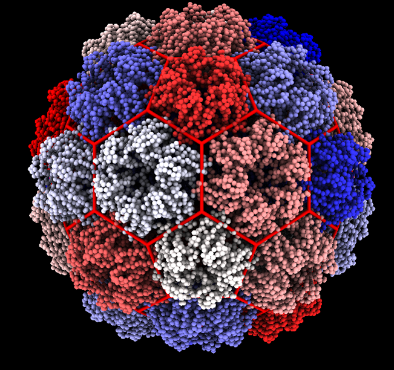

# Chapter 4: Quasi Rigid Domain Decompostion Of Viral Capsids

## 4.1: Augmenting The Classification Scheme
The ambiguities of the classification scheme described in chapter 2 gives us the opportunity to include additional
assumptions that encode structural information about the capsid. Here we propose that the classification scheme be 
augmented with the following assumption.

*Assumption: Capsomers correspond to quasi rigid domains of a viral capsid*

Here we use the same definition of a quasi rigid domain as described in [ref]. A rigid structures is a structure in
which the distances between elements of the structure are fixed over time and under transformations in space. A quasi-rigid structure
is thus a structure where the fluctuations between elements of the structure are minimized. We calculate the pairwise
distance fluctuation of a structure in the following manner.

$$
\begin{equation}
    f^{2}_{ij} = Var(d^{2}_{ij}) = \langle d^{2}_{ij} \rangle - \langle d_{ij} \rangle ^{2}
\end{equation}
$$

A quasi rigid domain of a protein structure is a domain of the protein which satisfied our definition of a quasi rigid 
structure.

## 4.2 Normal Mode Analysis

## 4.3 Elastic Network Models

## 4.4 Spectral Clustering

## 4.5 Results

