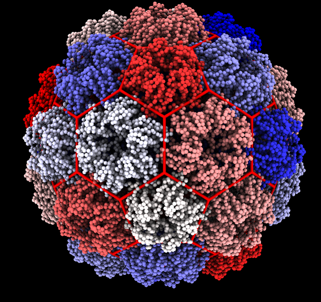

# Home (TESTING)

My name is Colin Brown, an MS student in Physics at San Diego State University. This page contains a record of my contributions
to Luque Lab and
the ongoing development of my Master's Thesis. I primarily analyze the structural and geometric properties of viral capsids with 
coarse grained physical models.

# Ongoing Projects

## Classifying Viral Capsids via Quasi-Rigid Domain Decomposition

I am developing a tool based on the work in [Ponzoni & Polles 2015](https://www.sciencedirect.com/science/article/pii/S0969212615002270?via%3Dihub)
that uses Normal Mode Analysis and Elastic Network Models to decompose a protein structure into its quasi-rigid subunits.
I am applying this tool to capsids and using the results to assist in the classification of capsids using the scheme
described in [Twarock & Luque(2019)](https://www.nature.com/articles/s41467-019-12367-3).
The details of this method are included in Chapter 4 of my thesis and the project is located in a 
[Github Repository.](https://github.com/luquelab/mechanical_subdivision_ProDy)

## Catalogue Of Capsid Classifications

I am part of a group effort in Luque Lab to create a catalogue of classifications of Viral Capsids based on their geometry.
This project is ongoing at this [Github Repository.](https://github.com/luquelab/auto-lattice)

# Completed Projects

## ChimeraX hkcage

I developed a tool for the free molecular visualization software [ChimeraX](https://www.rbvi.ucsf.edu/chimerax/). The
tool was an extension of the 'hkcage' tool already present in ChimeraX to generate Geodesic & Goldberg Polyhedra to a
set of new geometries described in [Twarock & Luque(2019)](https://www.nature.com/articles/s41467-019-12367-3). This tool
is now part of the official ChimeraX Toolshed. ([ChimeraX Documentation.](https://www.nature.com/articles/s41467-019-12367-3))
The tool is also being developed and documented in a [Github Repository.](https://github.com/luquelab/hkcage)

## Coarse Grained Models Of Viral Capsids

I created coarse grained toy models of capsids based on those used in [Zandi & Reguera 2004](https://www.pnas.org/content/101/44/15556)
for the purpose of comparing standard hexagonal capsid structures with trihexagonal capsid structures.

## 

